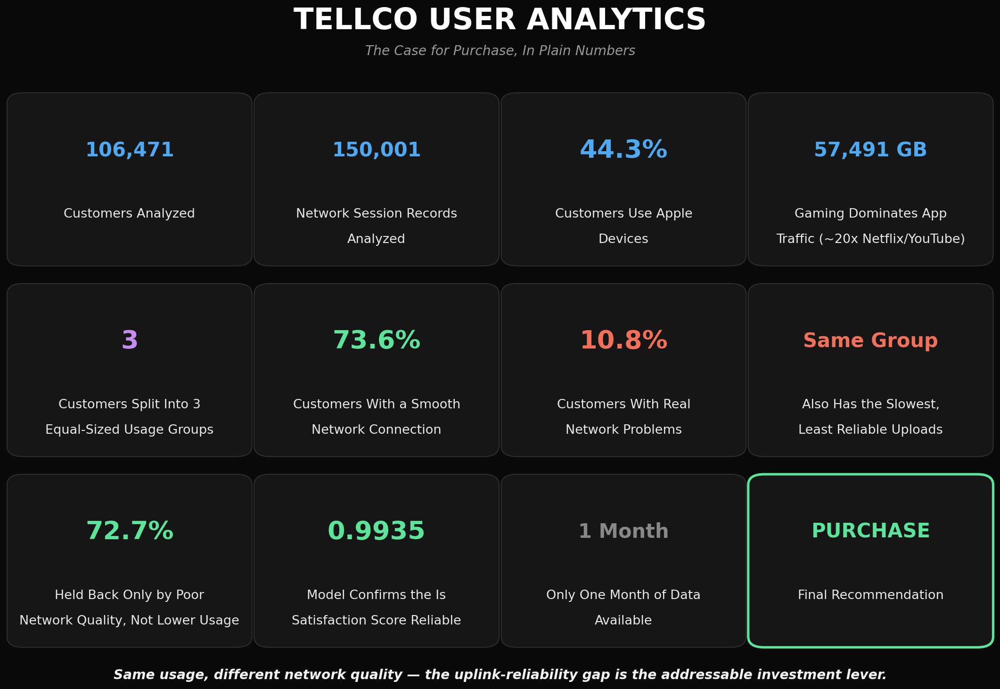

# 📡 TELCO USER ANALYTICS
### *A Data-Driven Due-Diligence Analysis of TellCo for Acquisition Decision-Making*


---

### **From Raw xDR Records to an Acquisition Recommendation**

An end-to-end due-diligence analysis of TellCo, a mobile service provider, built for a wealthy investor evaluating an acquisition. The project combines rigorous data cleaning, exploratory analysis, customer segmentation, network experience diagnostics, satisfaction modeling, and SQL export into a single reproducible workflow — closing with a clear, evidence-backed purchase recommendation.

Rather than treating each of the four analytical pillars (Overview, Engagement, Experience, Satisfaction) as isolated exercises, this notebook builds them as one connected story: understanding *who* TellCo's customers are, *how* they use the network, *whether* the network actually serves them well, and *what* ultimately drives their satisfaction — arriving at a single, specific, actionable investment lever.

---

<p align="center">
  
</p>
<p align="center"><i>XGBoost vs. Linear Regression on Satisfaction Score prediction — the final modeling step before the acquisition recommendation.</i></p>

---

> **⚠️ EVALUATION NOTICE:**
> Full findings, interpretations, and the final acquisition recommendation are detailed throughout the
> notebook itself (each section closes with an Interpretation and a Summary block answering that
> section's own framing question) and in the accompanying presentation's **Speaker Notes**. Please
> download the raw [TellCo_User_Analytics_Presentation](./TellCo_User_Analytics_Presentation_YS.pptx)
> file for the full analytical breakdown intended for the investor audience.

---

## 📌 Project Overview

TellCo's current owners have shared their system-generated xDR (data session) records but have never had anyone analyze them. The investor's standard due-diligence question is always the same: is the fundamental business sound, and if so, where is the highest-leverage opportunity to improve it?

This project answers that question through four connected analyses — User Overview, User Engagement, User Experience, and User Satisfaction — each grounded in real customer-level evidence rather than surface-level aggregate statistics, and each explicitly checking its own conclusions against a "beyond the minimum ask" bar: outlier detection before treatment, elbow/silhouette validation of every fixed cluster count, model comparison rather than a single unchallenged regression, and an honest accounting of every methodological limitation along the way.

The analysis is driven by one central business question:

> **Is TellCo a sound acquisition, and if so, where specifically should the investor focus to drive profitability?**

---

## 🎯 Project Objectives

- Characterize TellCo's customer base — device usage, manufacturer share, and usage rhythm — at a granular level.
- Identify the applications and handsets that dominate network traffic.
- Segment customers into meaningful engagement and network-experience clusters.
- Quantify customer satisfaction and validate it against a predictive model, with an honest account of that validation's limits.
- Export the final customer-level scoring table to a local SQL Server database.
- Deliver a clear, data-backed recommendation on whether TellCo represents a sound acquisition — and if so, what the investor's first move should be.

---

## ❓ Key Business Questions

1. Who is TellCo's typical customer, and which handsets/manufacturers dominate the network?
2. How does customer engagement vary — is there one "power user" profile, or several distinct kinds?
3. Is TellCo's network actually delivering a good experience, and if not, who is affected?
4. What actually drives customer satisfaction — engagement, network experience, or both?
5. Can satisfaction be modeled reliably, and what are the honest limits of that model?
6. Should the investor purchase TellCo, and if so, where should their first investment go?

---

## 🚀 Analytical Workflow

The notebook follows fifteen sections, each building on the last — from raw record cleaning through to a final purchase recommendation.

| Section | Purpose |
|---|---|
| **01. Importing and Inspecting the Data** | Load the 150,001-row xDR dataset, inspect structure, and audit missing values. |
| **02. Data Cleaning** | Resolve duplicate/inconsistent columns, correct data types, and treat missing values — including a session-level distinction between genuine measurement gaps (median-filled) and true zero-activity (zero-filled). |
| **03. Feature Engineering** | Correct a flawed `Total DL (Bytes)` calculation, remove redundant columns, and build the first per-customer aggregation. |
| **04. User Overview — *Who Is TellCo's Customer?*** | Full univariate/bivariate/multivariate EDA: handset and manufacturer distribution, temporal/geographic usage patterns, outlier treatment, decile segmentation, correlation analysis, and PCA. |
| **05. Encoding** | Frequency-encode categorical variables for downstream modeling. |
| **06. User Engagement — *Finding TellCo's Power Users*** | Aggregate engagement metrics per customer, K-Means (k=3) segmentation, per-application traffic breakdown, and an elbow/silhouette check against the fixed k. |
| **07. User Experience — *Is TellCo's Network Actually Good?*** | Build network-quality metrics per customer (TCP retransmission, RTT, throughput), detect and treat outliers using real skew/kurtosis/IQR evidence, profile experience by handset type, and cluster customers into experience tiers. |
| **08. User Satisfaction Analysis** | Score every customer's Engagement and Experience distance from the "worst" cluster, combine into a Satisfaction Score, compare two regression models (Linear Regression baseline vs. XGBoost) to predict it, and segment customers into satisfaction tiers (k=2). |
| **09. Data Export to SQL** | Export the final customer-level scoring table to a local SQL Server database via Windows Authentication. |
| **10. Executive Summary** | Synthesize findings across all four analytical pillars. |
| **11. Business Recommendation** | Translate findings into a specific, actionable growth-investment recommendation. |
| **12. Limitations** | Honest account of what this analysis cannot determine — sampling bias, an unresolved device-identity question, and a modeling circularity caveat. |
| **13. Challenges & Key Learnings** | The real debugging and design-decision journey behind the final notebook. |
| **14. Conclusion** | Final purchase recommendation, and confirmation against the project's original expected outcomes. |
| **15. Future Scope** | Items explicitly descoped from the original brief, and natural next steps. |

---

## 📂 Dataset Overview

| Property | Detail |
|---|---|
| **Dataset** | `telcom_data.csv` |
| **Raw Records** | 150,001 xDR (data session) records |
| **Raw Columns** | 55 |
| **Unique Customers (MSISDN)** | 106,471 |
| **Time Span** | One month of aggregated xDR records |
| **Prediction Type** | Unsupervised segmentation (K-Means) + supervised regression (Satisfaction Score) |

A defining characteristic of this dataset: **72.74% of customers have exactly one recorded session** — a fact that materially shapes how several findings throughout the notebook must be interpreted (see Limitations).

---

## 🧹 Data Cleaning & Feature Engineering

Beyond standard cleaning, this notebook resolved two genuine, non-obvious data issues:

- **`Bearer Id` integer overflow** — this identifier's raw values (~1.31e19) exceed `int64`'s maximum (~9.22e18); an initial blanket type-correction step silently overflowed it to a fixed sentinel value for every row. Root-caused and excluded from the cast, since it's a pure identifier only ever used for counting.
- **`Total DL (Bytes)` miscalculation** — the original aggregation omitted a traffic category, corrected before any downstream feature relied on it.

Missing-value treatment distinguishes between genuine measurement gaps (RTT — median-filled) and true zero-activity (TCP retransmission — zero-filled, reflecting "absence, not a measurement gap").

---

## 📊 User Overview: Who Is TellCo's Customer?

A full univariate → bivariate → multivariate EDA pipeline, matching the depth explicitly requested by this section's own brief.

**Key findings:**
- Apple (44.26%), Samsung (30.16%), and Huawei (25.58%) represent the top three manufacturers by session share.
- **Huawei B528S-23A** is the single most-used individual handset (19,727 sessions) — a concentration unlike Apple's spread across many iPhone generations. Its model name is consistent with Huawei's 4G router product line rather than a personal handset; this remains an open, unresolved question (see Limitations).
- Usage follows a sharp single-hour 7 AM spike rather than a gradual ramp-up, with traffic distributed geographically rather than concentrated.
- PCA shows customer usage cannot be compressed into one or two dominant metrics — **9 of the available components are needed to explain 95% of variance.**

---

## 📈 User Engagement: Finding TellCo's Power Users

**Key findings:**
- K-Means (k=3, per the brief) finds three comparably-sized clusters (36,631 / 40,236 / 29,604 customers) — no single dominant "power user" segment.
- Engagement genuinely has two independent dimensions: one cluster is time-engaged (longest session duration), a separate cluster is traffic-intensity heavy (highest volume per session) — these are not the same customers.
- Once the ambiguous `Other` traffic category is excluded, **Gaming drives roughly 19–20x more traffic than Netflix or YouTube**, which are themselves nearly tied.
- An elbow/silhouette check found k=4 as the data's natural optimum alongside the brief's required k=3 — reported transparently as a discrepancy, not acted on.

---

## 🌐 User Experience: Is TellCo's Network Actually Good?

Outlier detection here was evidence-first: skewness, kurtosis, and IQR/Z-score outlier rates were computed and compared *before* any treatment decision — TCP retransmission and RTT showed outlier rates (12.6%–20.4% by IQR) meaningfully higher than the User Overview section's comparable metrics (3.05%–7.64%), a genuine finding in its own right.

**Key findings:**
- **73.6% of customers** show minimal network friction — though this likely reflects light, often single-session usage more than confirmed superior network treatment.
- A smaller segment (**10.8% of customers**) pushing the heaviest uplink traffic shows simultaneously the highest TCP retransmission and worst uplink latency — a real, concentrated reliability concern, not a network-wide failure.
- An elbow check found k=3 as the data's natural optimum for a k=3-specified clustering — the one section where the fixed k and the data-driven signal agreed.

---

## 💯 User Satisfaction Analysis

Engagement and Experience Scores are computed as each customer's Euclidean distance from their respective "worst" cluster centroid — with both the least-engaged and worst-experience clusters identified programmatically from actual cluster metric values, not assumed by arbitrary cluster label.

**Key findings:**
- The two satisfaction clusters (k=2, per the brief) are **nearly identical on Engagement Score** (0.383 vs. 0.430) but **sharply divided on Experience Score** (0.771 vs. 0.183) — satisfaction here is overwhelmingly an experience story, not an engagement one.
- **72.7% of customers** engage at a comparable or even slightly higher rate than the more-satisfied minority, yet land in the lower-satisfaction segment purely due to worse network experience.
- Two regression models were compared to predict Satisfaction Score — **Linear Regression (R² = 0.7902, CV R² = 0.7909)** as a genuine baseline, and **XGBoost (R² = 0.9934, CV R² = 0.9935)** as the stronger, final model. Both models' near-identical R²/CV R² rule out overfitting.
- **Important caveat, stated plainly rather than hidden:** Satisfaction Score is a deterministic formula built from the same features used to predict it — these results measure how well each model reconstructs a known formula, not a fully independent prediction of unseen customer behavior.

---

## 🗄️ SQL Export

The final table (`MSISDN/Number`, Engagement Score, Experience Score, Satisfaction Score) is exported to a local SQL Server Express database (`TelecomDB`) via Windows Authentication, using `sqlalchemy` and `pyodbc`. Column names are cleaned for SQL compatibility (spaces and `/` replaced with underscores) on the exported copy only — the original `user_satisfaction` DataFrame, used throughout this notebook's analysis, is left unchanged.

> **Note:** This section must be run locally, not in Google Colab. Windows Authentication requires the notebook to execute on the same machine as the SQL Server Express instance.

---

## 💼 Business Recommendation

**Recommendation: TellCo is worth purchasing.**

The customer base is broad, engaged, and largely well-served — this is not a business in decline, nor one with a diffuse, expensive-to-fix problem. It has one clearly identified, addressable weak point: **uplink network reliability for the specific 10.8% of customers with the heaviest uplink traffic**, whose poor network experience — not their engagement level — is what separates them from the majority's satisfaction.

This is a favorable acquisition profile: the improvement lever is specific rather than structural, the affected segment is identifiable rather than diffuse, and the majority of the customer base already reflects a functioning, engaged relationship with the network.

---

## 🗂️ Repository Structure

```text
NHIS_Project5/
│
├── Assets/
│   ├── telcom_data.csv                          # Source xDR dataset
│   ├── Field_Descriptions.csv                   # Column dictionary
│   └── [chart PNGs generated throughout the notebook]
│
├── telecom_user_analytics_final.ipynb           # Complete end-to-end notebook
├── TellCo_User_Analytics_Presentation_YS.pptx   # Project presentation
├── requirements.txt                             # Project dependencies
└── README.md                                    # Project documentation
```

---

## 📦 Library Architecture

| Library | Purpose |
|---|---|
| **pandas** | Data manipulation and preprocessing |
| **numpy** | Numerical computing |
| **matplotlib** | Static data visualization |
| **seaborn** | Statistical visualizations |
| **scipy** | Statistical analysis (skewness, kurtosis, KDE) |
| **scikit-learn** | Preprocessing, clustering (K-Means), regression, and evaluation |
| **xgboost** | Gradient boosting regression model |
| **sqlalchemy** | SQL Server connection and export |
| **pyodbc** | ODBC driver interface for SQL Server |
| **jupyter** | Notebook development environment |

<details>
<summary><b>Exact pinned versions (requirements.txt)</b></summary>

```text
numpy==2.2.0
pandas==2.2.3
matplotlib==3.10.0
seaborn==0.13.2
scipy==1.15.0
xgboost==2.1.4
scikit-learn==1.6.1
jupyter==1.1.1
notebook==7.3.2
ipykernel==6.29.5
ipython==8.31.0
pyodbc==5.3.0
SQLAlchemy==2.0.51
```

</details>

---

## 💻 Installation & Setup

### Prerequisites

- Python **3.10** or above
- For the SQL Export section only: SQL Server Express (local instance), SSMS, and the ODBC Driver 18 for SQL Server (installed separately from the Python packages — see the SQL Export section's setup notes in the notebook)

---

### Option 1 — Google Colab *(Recommended for Sections 01–08)*

1. Upload `telecom_user_analytics_final.ipynb` to your Google Colab session.
2. If the dataset is not available locally, the notebook automatically downloads `telcom_data.csv` from GitHub.
3. Run the notebook sequentially from top to bottom.
4. **Section 09 (SQL Export) will not run in Colab** — see Option 2 for this section specifically.

---

### Option 2 — Local Virtual Environment *(Required for Section 09)*

#### 1. Clone the repository

```bash
git clone https://github.com/S-Yousuf-S/NHIS_Project5.git
cd NHIS_Project5
```

#### 2. Create a virtual environment

```bash
python -m venv TELECOM_ENV
```

#### 3. Activate the environment

**Windows**

```bash
TELECOM_ENV\Scripts\activate
```

**macOS / Linux**

```bash
source TELECOM_ENV/bin/activate
```

#### 4. Install the required libraries

```bash
pip install -r requirements.txt
```

#### 5. Launch Jupyter Notebook

```bash
jupyter notebook telecom_user_analytics_final.ipynb
```

> **Note:**
>
> Run the notebook sequentially from the first cell to the last to reproduce the complete workflow. Section 09 (SQL Export) additionally requires SQL Server Express running locally, with TCP/IP enabled via SQL Server Configuration Manager and the SQL Server Browser service running (see the notebook's SQL Export section for full setup notes).

---

## 🙋 Frequently Asked Questions

**Q: Why does the analysis diverge from the brief's exact wording in a few places (e.g., median instead of mean, IQR instead of Z-score)?**

**A:** Each deviation is documented at the point it's made, with a specific justification tied to the data (e.g., severe right-skew making Z-score unreliable, confirmed by comparing IQR vs. Z-score outlier detection rates side by side). These are treated as documented improvements on the brief's minimum, not silent departures from it.

**Q: Why are RTT and Throughput kept separate by direction (DL/UL) while TCP retransmission is combined?**

**A:** TCP retransmission volume is a genuine additive quantity (bytes) — DL+UL combines into a real total. RTT (a latency) and Throughput (a rate) are not volumes; combining them would mask direction-specific network issues, such as strong downlink paired with a congested uplink.

**Q: Why does the notebook fix k=3 or k=2 for clustering but also run an elbow-method check?**

**A:** The brief specifies these k values explicitly, with no k-optimization requested. The elbow checks are a "beyond the ask" transparency addition — reporting where the data's own optimum sits, honestly, even where it disagrees with the specified k, rather than silently confirming whatever number was assigned.

**Q: Why was Random Forest replaced with XGBoost for the Satisfaction Score regression?**

**A:** An initial Random Forest run took over 25 minutes to train and cross-validate on 106,471 rows even with parallelization enabled, due to unconstrained tree depth. XGBoost's histogram-based split-finding achieved a stronger result (R² = 0.9934 vs. 0.98) in under 2 minutes — a substantial practical advantage at this dataset size.

**Q: Is the XGBoost R² = 0.9934 result a fully independent prediction of customer satisfaction?**

**A:** No, and this is stated explicitly rather than glossed over. Satisfaction Score is a deterministic formula built directly from the same underlying features used as regression predictors — a sufficiently flexible model can reconstruct it closely almost regardless of algorithm choice. This result measures formula-reconstruction accuracy, not independent behavioral prediction; see Limitations for the full discussion.

**Q: Why does the SQL Export section explicitly say it must be run locally?**

**A:** The export uses Windows Authentication (`trusted_connection=yes`), which requires the code to execute on the same physical machine as the SQL Server Express instance. Google Colab runs on a cloud VM with no network path to a local machine's SQL Server — this is a hard constraint, not a configuration option.

**Q: 73.6% of customers show the "best" network experience, and one cluster shows the lowest engagement friction too — does that mean most customers are genuinely well-served?**

**A:** Partially, and this is deliberately not overstated in the notebook. 72.74% of all customers have exactly one recorded session — for these customers, every "average" metric is really just one raw reading, not genuine behavior measured over time. A single light session naturally produces low retransmission counts and low RTT variance, independent of true network quality. This is stated as a limitation, not silently assumed away — the "well-served majority" finding is likely real, but its strength is probably somewhat overstated by this sampling artifact.

**Q: Is the Huawei B528S-23A really a shared router rather than a personal handset?**

**A:** Unresolved, and stated as such. The model name is consistent with Huawei's 4G router product line, and it is the single most-used device in the dataset by a wide margin — but a direct traffic-per-session check against all other handsets found no meaningful difference (a 1.00x ratio), which does not support the hypothesis on this metric, though it doesn't rule it out either. This is an open question the dataset cannot settle, flagged honestly as a limitation rather than a resolved finding.

---

## 📌 Conclusion

This project demonstrates a complete due-diligence analytical workflow — from raw xDR record cleaning through customer segmentation, network diagnostics, satisfaction modeling, and SQL export, closing with a specific, evidence-backed acquisition recommendation.

Rather than treating each of the four analytical pillars in isolation, the notebook connects them into one throughline: TellCo's customer base is broad and reasonably well-served on average, but network experience — not customer engagement or interest — is the single clearest lever separating satisfied customers from dissatisfied ones, concentrated in a specific, identifiable minority rather than spread evenly across the base.

**Final recommendation: Purchase, with uplink network reliability investment as the specific first move.**

---

## 🚀 Future Scope

- **Descoped from the original brief** (by supervisor agreement): a reusable pip-installable package with unit tests and CI/CD, Docker containerization, a Streamlit/Flask dashboard, and model deployment/tracking.
- **Multi-user SQL connection handling** — the current export assumes one analyst running locally with Windows Authentication; a distributable version would need a proper credential-input flow.
- **Multi-month trend analysis** — this analysis reflects one month of data; extending to multiple months would allow genuine trend detection on the uplink-strain finding.
- **Resolving the Huawei B528S-23A open question** via device registration data or IMEI-range lookups external to this dataset.
- **A/B validation** — re-running this same pipeline on new data after any actual network improvement, to confirm the recommended fix measurably improved the flagged segment's scores.

---

# 👤 Author

**Yousuf S. R. Sakkaf**

**GitHub:** https://github.com/S-Yousuf-S

---

⭐ *If you found this project helpful or insightful, consider giving the repository a star.*
